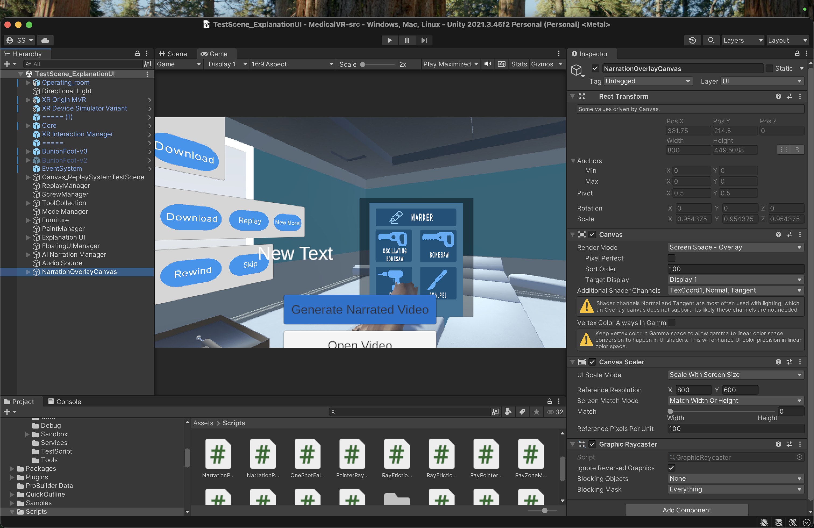
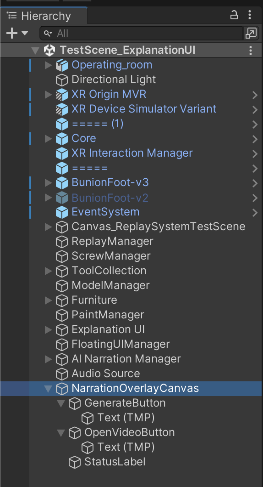
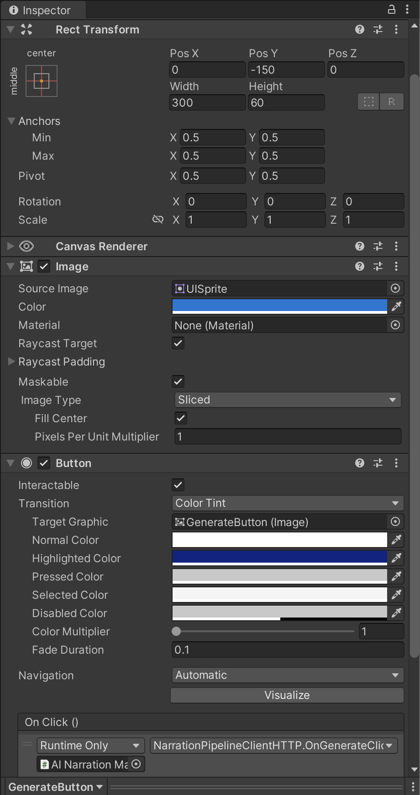
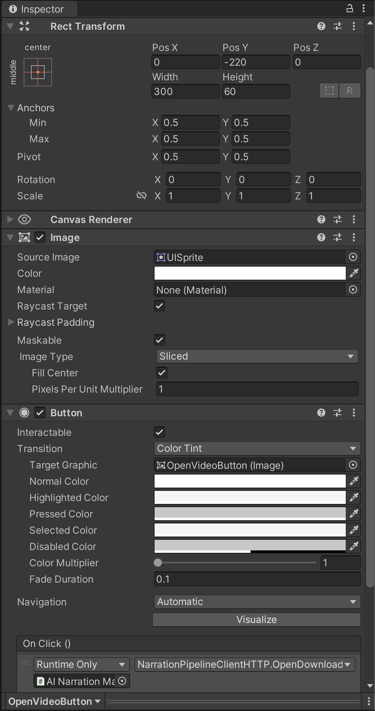
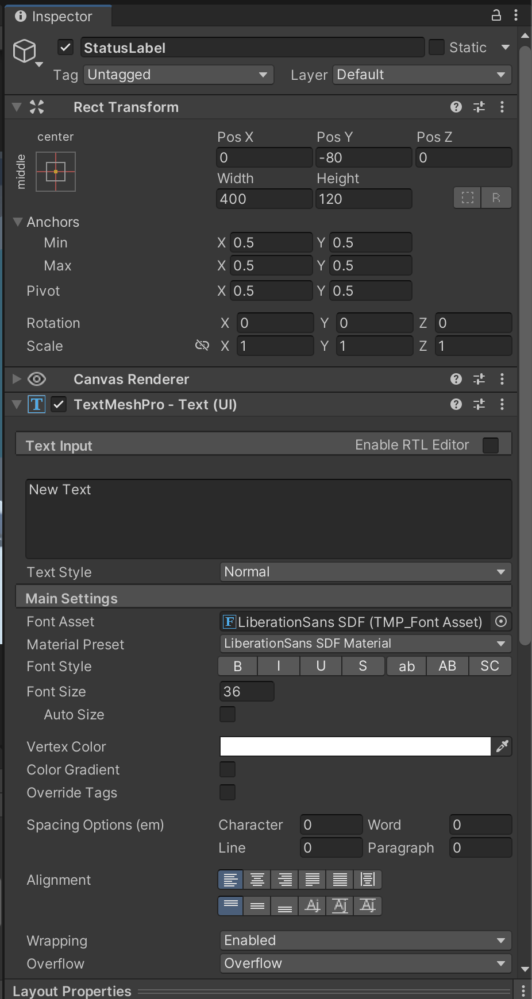
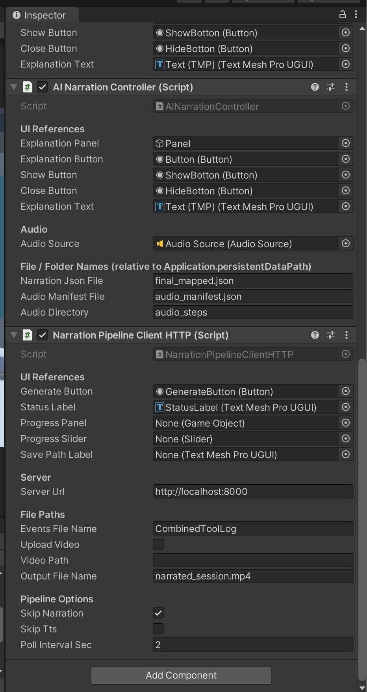
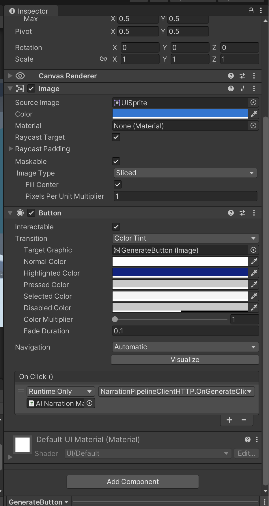
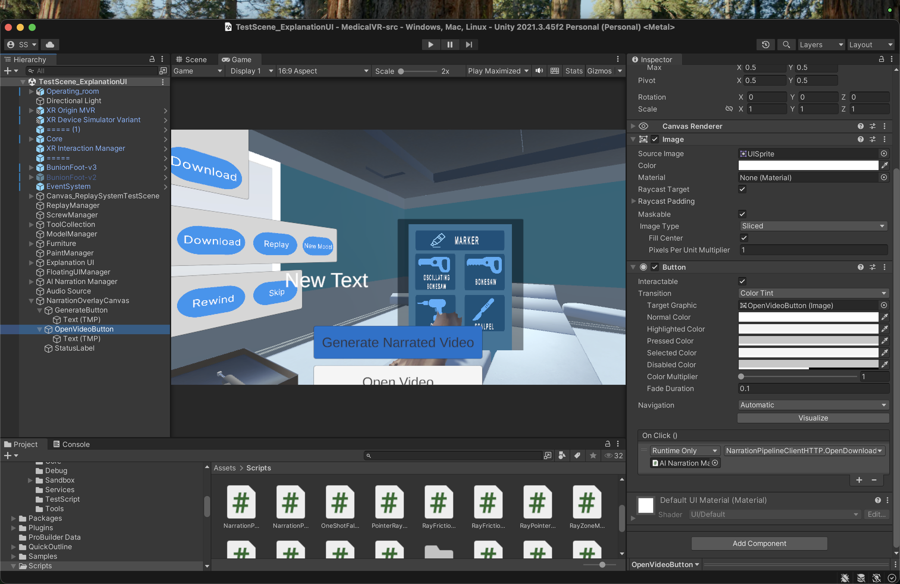

# MediverseVR — Unity Integration Guide

This folder contains the Unity-side C# scripts that let a VR headset trigger the MediverseVR narration pipeline. Press a button in VR → server runs the pipeline → narrated MP4 downloads to the device.

---

## What's in this folder

| File | Purpose |
|---|---|
| `NarrationPipelineClientHTTP.cs` | **Main script.** Button-triggered HTTP client that sends events JSON to the server, polls for status, downloads the final MP4, and opens it. Works on standalone Quest and tethered PC. |
| `NarrationPipelineClient.cs` | Alternative script that launches `run_pipeline.py` directly via `System.Diagnostics.Process`. Editor and tethered PC only — does not work on Quest. Useful for local development. |
| `NarrationPipelineTrigger.cs` | VR-narration-only variant. Downloads `final_mapped.json` + WAVs for in-headset audio playback (no MP4). Used for the in-VR `ExplanationUIController` flow. |

For this demo the one you care about is **`NarrationPipelineClientHTTP.cs`**.

---

## Overview — how the pieces fit together

```
┌─────────────────────────────────────────────────────────────────┐
│                        Unity Scene                              │
│                                                                 │
│   [NarrationOverlayCanvas]  ←  Sort Order 100 (always on top)   │
│       ├─ GenerateButton     ──→ clicks trigger pipeline         │
│       ├─ OpenVideoButton    ──→ clicks open downloaded MP4      │
│       └─ StatusLabel        ──→ displays pipeline progress      │
│                                                                 │
│   [AI Narration Manager]                                        │
│       └─ NarrationPipelineClientHTTP (script)                   │
│           ├─ Inspector fields wire UI references + server URL   │
│           └─ OnClick listeners call into its methods            │
│                                                                 │
└─────────────────────────────────────────────────────────────────┘
                              │
                HTTP POST     │     HTTP GET
                              ▼
┌─────────────────────────────────────────────────────────────────┐
│              server.py (localhost:8000 or Render)               │
│              Runs: narration → TTS → SRT → ffmpeg               │
│              Returns: narrated_session.mp4                      │
└─────────────────────────────────────────────────────────────────┘
```

---

## Setup — Step by Step

### 1. Copy the scripts into Unity

Copy all three `.cs` files into your Unity project:
```
Assets/Scripts/NarrationPipelineClientHTTP.cs
Assets/Scripts/NarrationPipelineClient.cs
Assets/Scripts/NarrationPipelineTrigger.cs
```

Unity will auto-compile them. Check the Console for errors — there should be none.

---

### 2. Create the overlay canvas

This canvas floats above all other UI so the Generate/Open Video buttons are never blocked by teammate panels.

1. In the Hierarchy, right-click in empty space → **UI → Canvas**
2. Rename it to `NarrationOverlayCanvas`
3. On the Canvas component in Inspector:
   - Render Mode: **Screen Space - Overlay**
   - Sort Order: **100**
4. Add a **Canvas Scaler** component if not already present:
   - UI Scale Mode: Scale With Screen Size
   - Reference Resolution: 800 x 600



---

### 3. Add the three UI children

Under `NarrationOverlayCanvas`, create three child objects:

#### 3a. StatusLabel
- Right-click canvas → **UI → Text - TextMeshPro**
- Rename to `StatusLabel`
- Rect Transform: anchor to middle-center, Pos X = 0, Pos Y = -80, Width = 400, Height = 120
- TextMeshPro: set **Overflow → Overflow** (not Truncate) so long messages wrap
- Font Size: 24

#### 3b. GenerateButton
- Right-click canvas → **UI → Button**
- Rename to `GenerateButton`
- Rect Transform: anchor to middle-center, Pos X = 0, Pos Y = -150, Width = 300, Height = 60
- Rotation: **all zeros** (X=0, Y=0, Z=0)
- Scale: **1, 1, 1**
- Child Text: change to "Generate Narrated Video"

#### 3c. OpenVideoButton
- Right-click canvas → **UI → Button**
- Rename to `OpenVideoButton`
- Rect Transform: anchor to middle-center, Pos X = 0, Pos Y = -230, Width = 300, Height = 60
- Rotation: **0, 0, 0**; Scale: **1, 1, 1**
- Child Text: change to "Open Video"









---

### 4. Create the AI Narration Manager GameObject

1. In the Hierarchy, right-click in empty space → **Create Empty**
2. Rename to `AI Narration Manager`
3. Reset its Transform (right-click Transform → Reset)
4. Select it, click **Add Component** in Inspector, search `NarrationPipelineClientHTTP`, and add it

---

### 5. Wire the Inspector fields

On `AI Narration Manager` → `NarrationPipelineClientHTTP (Script)`:

| Field | Value |
|---|---|
| **UI References** | |
| Generate Button | Drag `GenerateButton` from Hierarchy |
| Status Label | Drag `StatusLabel` from Hierarchy |
| Progress Panel | Leave `None` (optional) |
| Progress Slider | Leave `None` (optional) |
| Save Path Label | Leave `None` (optional) |
| **Server** | |
| Server Url | `http://localhost:8000` (change to Render URL for cloud deployment) |
| **File Paths** | |
| Events File Name | `CombinedToolLog` (no `.json` extension) |
| Upload Video | ☐ unchecked (server uses demo_recording.mp4 as fallback) |
| Video Path | Leave empty |
| Output File Name | `narrated_session.mp4` |
| **Pipeline Options** | |
| Skip Narration | ☑ checked (skips the 22-minute BioMistral step — uses existing `final_mapped.json`) |
| Skip Tts | ☐ unchecked |
| Poll Interval Sec | `2` |



---

### 6. Wire the button OnClick handlers

#### GenerateButton
1. Select `GenerateButton` in Hierarchy
2. In Inspector → Button component → find the **On Click ()** section at the bottom
3. Click the **+** to add an entry
4. Runtime Only (leave as default)
5. Drag `AI Narration Manager` from Hierarchy into the object slot
6. In the function dropdown, select `NarrationPipelineClientHTTP → OnGenerateClicked ()`



#### OpenVideoButton
1. Select `OpenVideoButton` in Hierarchy
2. Button component → **On Click ()** → **+**
3. Drag `AI Narration Manager` into the object slot
4. Select `NarrationPipelineClientHTTP → OpenDownloadedVideo ()`



---

## Running the demo

### 1. Start the server
In a Terminal window:
```bash
cd /path/to/MediverseVR
.venv/bin/python server.py
```
Keep this Terminal open — closing it stops the server.

### 2. Verify the server is alive
Open a browser and go to `http://localhost:8000/health`. You should see:
```json
{"status":"ok"}
```

### 3. Press Play in Unity
Click the Play button. The scene loads, VR simulator becomes active.

### 4. Click "Generate Narrated Video"
Watch the Unity Console. You should see a sequence like:
```
[NarrationHTTP] OnGenerateClicked called. _isRunning=False
[NarrationHTTP] Connecting to server...
[NarrationHTTP] Server reachable. Uploading events...
[NarrationHTTP] POST http://localhost:8000/process
[NarrationHTTP] Job started: <uuid>
[NarrationHTTP] Pipeline running...
[NarrationHTTP] Downloading video to device...
[NarrationHTTP] Video saved to: <path>/narrated_session.mp4
[NarrationHTTP] Done! Video saved. Press Open Video to watch.
```

Total time: ~15-20 seconds when `Skip Narration` is checked.

### 5. Click "Open Video"
QuickTime (on Mac) opens the downloaded MP4 with narration audio and burned-in subtitles.

---

## Debugging Keyboard Shortcuts

The script includes two keyboard shortcuts for testing without UI interaction:

| Key | Action |
|---|---|
| **H** | Trigger the pipeline (same as clicking Generate Narrated Video) |

Useful when you want to verify the script works independently of a button-click problem.

---

## Troubleshooting

### "Cannot reach server"
- Check the server Terminal is still running
- Visit `http://localhost:8000/health` in a browser
- If that fails, restart the server: Ctrl+C then `.venv/bin/python server.py`

### Button does nothing when clicked
- Check that another UI panel isn't blocking it. Select `GenerateButton` in Hierarchy → in the Scene view, look for overlapping panels with `Raycast Target` enabled on their Image component — uncheck it.
- Ensure `NarrationOverlayCanvas` has `Sort Order = 100` — this puts it above teammates' canvases.
- Check the Unity Console for `[NarrationHTTP] OnGenerateClicked called.` when you click — if it doesn't log, the button's OnClick isn't wired correctly.

### Video saved but won't open
- The `OpenDownloadedVideo` method uses macOS's `open` command which reliably launches QuickTime.
- For Windows/Linux it falls back to `Application.OpenURL`.
- Verify the file exists at the logged path — open Terminal: `ls -lh <path>/narrated_session.mp4`

### Audio overlaps in the video
- Fixed by `--no-original-audio` flag in `server.py` (strips the video's original audio, keeps only AI narration).
- Also fixed by the overlap-prevention logic in `compose_video.py` which pushes later clips back if they'd collide with earlier ones.

### Subtitles show boxes instead of characters (for non-English)
- Install Noto CJK font: `brew install --cask font-noto-sans-cjk-sc`
- Required for Mandarin/Japanese/Korean subtitle rendering via libass.

---

## For Standalone Quest (Untested — PC tethered only so far)

The `NarrationPipelineClientHTTP.cs` script uses `UnityWebRequest` which works on Android/Quest. For a Quest build:

1. Keep `Upload Video = false` — video upload from Quest over WiFi is too slow.
2. Server URL must point to a **cloud-deployed server** (Render, not localhost) because the Quest isn't on your laptop's local network.
3. Update `Server Url` in Inspector to the cloud URL: `https://your-app.onrender.com`
4. Build & deploy to Quest normally.

---

## Keeping in Sync with the Server

These Unity scripts talk to:
- `server.py` — main entry point
- `run_pipeline.py` — orchestrates steps 1-4
- `generate_step_audio.py` / `compose_video.py` / `generate_srt.py` — the steps themselves

If the server's `/process` endpoint changes its expected fields or `/status/{job_id}` response shape, update the JSON models at the bottom of `NarrationPipelineClientHTTP.cs`.

Current server endpoints used:
- `GET  /health` — server reachability check
- `POST /process` — submit job, returns `{job_id, status}`
- `GET  /status/{job_id}` — poll job progress, returns `{status, step, message}`
- `GET  /download/{job_id}` — fetch the finished MP4

---

## Contact

Questions about this integration? Ping Swetha. The pipeline is documented in the main `PLAN.md` at the repo root.